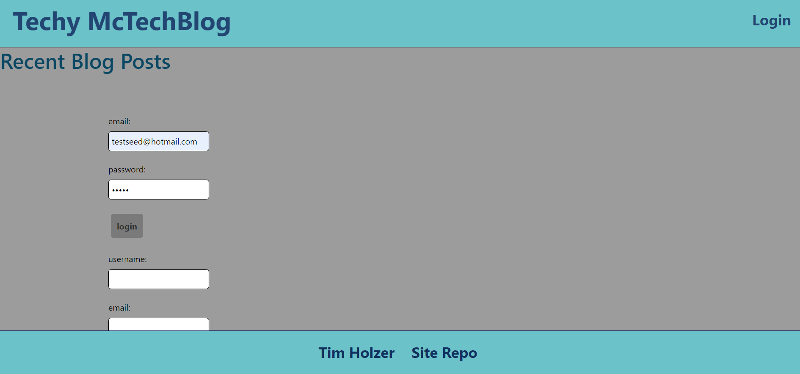

# CMS-Style-Blogsite
This program is a workout tracker that tracks various stats about cado and lifting workouts

    
* [Installation](#Installation)
    
* [Instructions](#Instructions)

* [Deployed Link](#Deployed-Link)
    
* [License](#License)
       
    ## Installation
    Make sure that you have Nodejs and mySQL installed. Copy the schema into your mySQL to create the database. You can seed the database with the command: node seeds/seed.js and run a localhost server with the command: node server.js.
    ## Instructions
    You can view posts and their comments from the dashboard. Create and account to be able to create new posts or add comments.
    ## Deployed Link
    https://cms-style-blogsite-holzer.herokuapp.com/

    ## License 
    This project is licensed under the MIT license
    - Email: timiholzer@gmail.com - GitHub Repo: https://github.com/timholzer/CMS-Style-Blogsite

